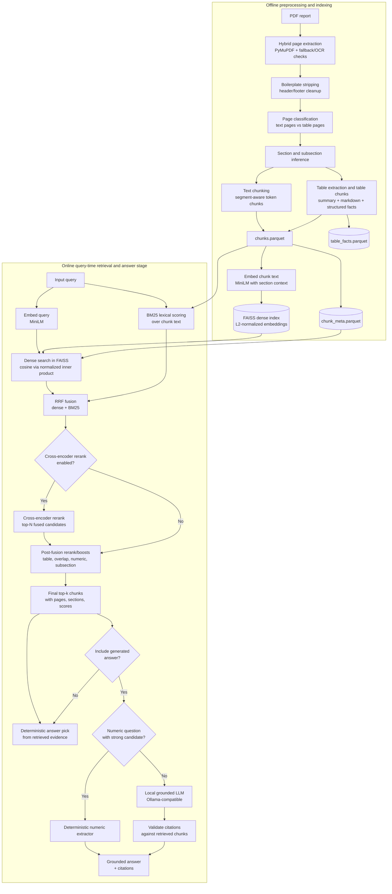

# Current RAG Pipeline Diagram

## Notes

- This reflects the current default retrieval path: hybrid dense + BM25 fusion, not dense-only.
- Cross-encoder reranking is optional, but post-fusion heuristic reranking is part of the service path.
- Table facts are produced during preprocessing, but chunk retrieval still operates over chunk text rather than `table_facts.parquet`.
- Generated answers are optional and citation-validated; retrieval can also be used without generation.

## Main code references

- Preprocessing: `scripts/preprocess_hybrid.py`
- Index build: `scripts/build_index.py`
- Hybrid retrieval and generation service: `src/rag_pdf/services/search_service.py`
- Fusion helpers: `src/rag_pdf/retrieval/canonical_hybrid.py`
- BM25 and shared retrieval utilities: `src/rag_pdf/retrieval/hybrid_utils.py`
- Local LLM wrapper: `src/rag_pdf/services/local_llm_service.py`
